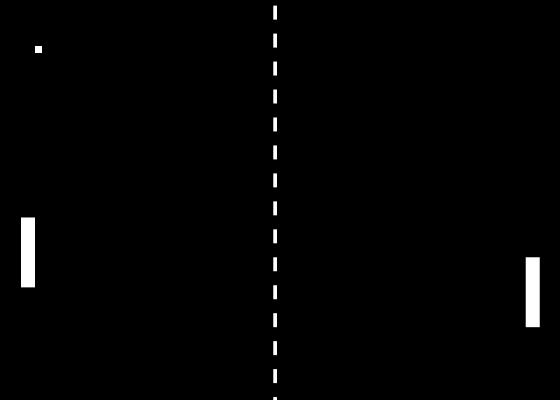

# Pong SDL2



This is a basic Pong clone made in SDL2 as a introduction to game development, where I made everything from scratch, except the window management.
In this game you can test how the ball reacts when it hits with any of the paddles or the upper and lower borders.

## Controls

| Player 1    | Player 2    |
|--------------- | --------------- |
| `W` - Move up   | `UP` - Move up   |
| `S` - Move Down   | `DOWN` - Move down   |

When the ball passes one of the paddles, the game doesn't restart. To restart the position of the ball with a random direction, press `R`.

## Requirements
- A C++ compiler installed (g++, clang, etc)
- Make

## Build the game
This proyect uses Make as a build system. 
You can build the game for your local machine with the command:
```bash
make build
```
And it will create a binary in the root folder.

You can create a binary with all the necesary libraries statically linked so it can run on other machine properly without the need of building it.
To do it just run:
```bash
make export
```
This will build the binary and link all the needed libraries.

After building, just run the binary named **pong** in the root directory.
